<p align="center">
  
</p>

<p align="center">
  <strong>한국어</strong>
  &nbsp;·&nbsp;
  <a href="./README.en.md">English</a>
  &nbsp;·&nbsp;
  <a href="https://patty.io">patty.io</a>
</p>

<p align="center">
  
  
</p>

<h3 align="center">에이전트 회사를 운영하는 컨트롤 플레인.</h3>

<p align="center">
  Pilot는 AI 에이전트로 구성된 회사를 띄우고 운영하기 위한 컨트롤 플레인입니다.<br/>
  목표를 정하고, 에이전트를 고용하고, 예산과 승인 게이트를 걸고,<br/>
  하나의 대시보드에서 작업·비용·진척을 추적합니다.
</p>

## 이 저장소가 하는 일

Pilot는 Node.js 서버와 React UI, CLI, 플러그인 SDK를 한 저장소에서 관리합니다.
에이전트 회사의 모든 상태 — 조직, 이슈, 예산, 승인, 활동 로그 — 는 회사 스코프로
격리되고, 모든 변경은 감사 추적에 남습니다. 이 저장소에는 다음이 함께 들어 있습니다.

- **server** — Express REST API, 하트비트 오케스트레이션, 예산 하드스톱,
  승인 게이트, 활동 로깅을 담당하는 운영 커널
- **ui** — React + Vite 보드 UI (칸반, 이슈 스레드, 에이전트 관리, 비용 대시보드)
- **packages/db** — Drizzle 스키마·마이그레이션 (임베디드 Postgres 기본, 외부 DB 옵션)
- **packages/adapters** — Claude, Codex, Cursor, Gemini, Kimi, pi 등 CLI 에이전트 어댑터
- **packages/plugins** — 샌드박스 프로바이더(k8s, Daytona, E2B, Modal, Cloudflare),
  LLM Wiki 등 플러그인 런타임과 SDK
- **packages/skills-catalog · teams-catalog** — 앱에 내장되는 스킬·팀 카탈로그
- **cli** — `pilotai` CLI (에이전트 우선, JSON in / JSON out)

## 설계 철학

1. **회사가 스코프다.** 모든 도메인 엔티티는 회사에 속하고, 회사 경계는 라우트·서비스
   레벨에서 강제됩니다. 에이전트 키는 다른 회사에 절대 닿지 않습니다.
2. **하트비트가 실행 단위다.** 에이전트는 짧은 실행 창(하트비트) 안에서 깨어나
   작업하고, 종료 시 다음 행동을 예약합니다. 폴링 없이 지속적으로 일합니다.
3. **승인이 게이트다.** 지배받는 행동(고용, 예산, 배포)은 보드 승인 없이는
   실행되지 않습니다. 승인은 이슈 스레드의 인터랙션 카드로 요청·해결됩니다.
4. **예산은 하드스톱이다.** 예산을 넘으면 실행이 자동 중단되고, 재개는
   명시적인 보드 조치로만 일어납니다.
5. **모든 변경은 활동 로그에.** 뮤테이션은 액터, 시각, 컨텍스트와 함께
   감사 로그에 기록됩니다.

제품 방향은 `doc/GOAL.md`와 `doc/PRODUCT.md`, 구현 계약은
`doc/SPEC-implementation.md`를 먼저 봅니다.

## 아키텍처

```text
 보드 운영자                     에이전트 (하트비트)
      │                                │
      ▼                                ▼
 ┌─────────────────── server ────────────────────┐
 │ REST API (/api) · 승인 게이트 · 예산 하드스톱  │
 │ 하트비트 스케줄러 · 활동 로그 · 시크릿 스토어   │
 └───────┬────────────────────────┬──────────────┘
         │                        │
   ┌─────▼─────┐           ┌─────▼──────────┐
   │ Postgres  │           │ 어댑터 런타임   │
   │ (임베디드) │           │ claude·codex·  │
   │ Drizzle   │           │ cursor·gemini· │
   └───────────┘           │ kimi·pi·http   │
                           └─────┬──────────┘
                                 │
                    ┌────────────▼────────────┐
                    │ 샌드박스 (k8s·Daytona·   │
                    │ E2B·Modal·Cloudflare)   │
                    └─────────────────────────┘

 클라이언트: ui (React 보드) · cli (pilotai) · MCP · 플러그인
```

## 빠른 시작

[Node.js 24+](https://nodejs.org), [pnpm](https://pnpm.io), Docker가 필요합니다.
개발용으로는 임베디드 PGlite를 쓰므로 `DATABASE_URL` 없이 시작합니다.

```bash
git clone git@github.com:patty-io/pilot.git && cd pilot
pnpm install
pnpm dev
```

API는 `http://localhost:3100`, UI는 같은 포트에서 미들웨어로 서빙됩니다.

```bash
curl http://localhost:3100/api/health
curl http://localhost:3100/api/companies
```

로컬 개발 DB를 초기화하려면:

```bash
rm -rf data/pglite
pnpm dev
```

## 자주 쓰는 명령

| 명령 | 용도 |
|---|---|
| `pnpm dev` | API + UI 개발 서버 |
| `pnpm test` | Vitest 단위 테스트 |
| `pnpm test:run` | CI용 전체 테스트 |
| `pnpm -r typecheck` | 전체 워크스페이스 타입 검사 |
| `pnpm build` | 전체 빌드 |
| `pnpm db:generate` | 스키마 변경 → 마이그레이션 생성 |

## 저장소 구조

```text
pilot/
├── server/                    Express API + 오케스트레이션 서비스
├── ui/                        React + Vite 보드 UI
├── packages/
│   ├── db/                    Drizzle 스키마·마이그레이션·DB 클라이언트
│   ├── shared/                공용 타입·상수·검증기
│   ├── adapters/              CLI 에이전트 어댑터 (claude, codex, cursor, ...)
│   ├── adapter-utils/         어댑터 공용 유틸
│   ├── plugins/               플러그인 시스템 (SDK, 샌드박스 프로바이더)
│   ├── skills-catalog/        내장 스킬 카탈로그
│   └── teams-catalog/         내장 팀 카탈로그
├── cli/                       pilotai CLI
├── skills/                    런타임·운영 스킬
├── deploy/                    Helm 차트, EKS 배포
├── doc/                       제품·운영 문서
└── releases/                  릴리스 노트
```

## 작업할 때 지키는 순서

1. [`AGENTS.md`](./AGENTS.md)의 저장소 규약을 먼저 읽습니다.
2. `doc/GOAL.md` → `doc/PRODUCT.md` → `doc/SPEC-implementation.md` →
   `doc/DEVELOPING.md` → `doc/DATABASE.md` 순서로 문서를 읽습니다.
3. 스키마·API 변경은 계약 동기화 규칙(`AGENTS.md` §5)을 지킵니다.
4. UI 변경은 `DESIGN.md` 토큰 게이트를 통과해야 합니다.
5. PR은 [템플릿](./.github/PULL_REQUEST_TEMPLATE.md)의 모든 섹션을 채웁니다.

## 라이선스

폐쇄 소스, 사내 운영. 이 저장소는 Patty 사내 제품입니다.
[LICENSE-PROPRIETARY.txt](./LICENSE-PROPRIETARY.txt)를 참고합니다.
